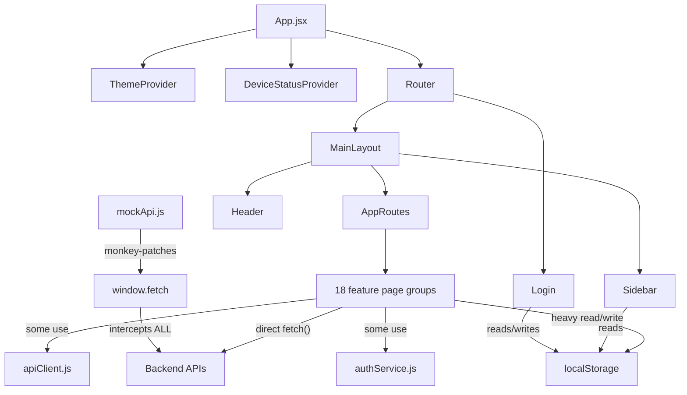

# FRONTEND ENGINEERING AUDIT REPORT
## BMS / SCADA-HMI Dashboard — `scada-hmi-dashboard`

**Audit Date:** 2026-09-02
**Auditor Perspective:** Senior Staff / Principal Frontend Engineer
**Priority Framework:** Security → Correctness → Reliability → Maintainability → DX → Performance

---

## 1. Executive Summary

This is a **React 18 + Vite 5** BMS (Building Management System) / SCADA dashboard for industrial IoT monitoring. The codebase covers ~115 JS/JSX files across 18 feature domains (Water Management, Energy Metering, HVAC, Fire Pumps, LT Panels, etc.).

**Overall verdict:** The application is functionally rich but architecturally fragile. It has **critical security issues** (tokens in localStorage, mock auth fallbacks in production code), **zero test coverage**, **no code splitting**, **massive God components** (Templates.jsx at 5,598 lines), and widespread violations of separation of concerns. The codebase works today but will become increasingly difficult and dangerous to maintain.

> [!CAUTION]
> **Top 3 risks that need immediate attention:**
> 1. **Authentication bypass via mock token fallback** in production code
> 2. **JWT tokens stored in localStorage AND cookies redundantly** — XSS attack surface
> 3. **Global `window.fetch` monkey-patch** silently masks backend errors

---

## 2. Technology Stack

| Technology | Value |
|---|---|
| **Framework** | React 18.2.0 |
| **Language** | JavaScript (JSX) — no TypeScript |
| **Build Tool** | Vite 5.1.6 |
| **Package Manager** | npm (package-lock.json) |
| **Routing** | react-router-dom 6.22.3 |
| **State Management** | React Context (2 contexts) + localStorage (heavily) |
| **Data Fetching** | Raw `fetch()` via custom [apiClient.js](file:///f:/SochIot%20Folder/Frontends/Bms_frontend/src/services/apiClient.js) |
| **API Client** | Custom `apiClient` object + `authService.js` (separate, different patterns) |
| **Authentication** | Custom cookie/localStorage token management |
| **Authorization** | Client-side `localStorage.getItem('userRole')` checks |
| **UI Library** | React-Bootstrap 2.10 + Bootstrap 5.3 |
| **Styling** | [global.css](file:///f:/SochIot%20Folder/Frontends/Bms_frontend/src/global.css) (1,393 lines) + per-component `dangerouslySetInnerHTML` inline `<style>` |
| **Icons** | lucide-react + react-icons (duplicate icon libraries) |
| **Charts** | Recharts 2.12 |
| **Animations** | framer-motion 11.0 |
| **PDF Generation** | jspdf + jspdf-autotable + html2canvas |
| **Image Processing** | jimp + pngjs (browser-side) |
| **WebSocket** | socket.io-client 4.8 |
| **Testing** | **None** — zero test files, no test framework installed |
| **Linting** | **None** — no ESLint config |
| **Formatting** | **None** — no Prettier config |
| **CI/CD** | **None** — no pipeline config found |
| **Environment** | [.env](file:///f:/SochIot%20Folder/Frontends/Bms_frontend/.env) with hardcoded URLs |
| **Deployment** | [vercel.json](file:///f:/SochIot%20Folder/Frontends/Bms_frontend/vercel.json) |

---

## 3. Current Architecture

The project follows an **ad-hoc page-centric structure**. There is no formal architecture pattern — responsibilities are not clearly separated.

```text
src/
├── App.jsx                     ← Entry point, auth state, providers
├── main.jsx                    ← React DOM render
├── global.css                  ← 1,393-line monolithic stylesheet
├── mockApi.js                  ← 1,618-line global fetch() monkey-patch (!)
├── assets/                     ← Static images
├── components/                 ← 7 shared components (underutilized)
├── context/                    ← ThemeContext only
├── layout/                     ← Header, Sidebar, MainLayout
├── pages/                      ← 18 feature domains (flat page files, some multi-thousand lines)
│   ├── AC/
│   ├── AQISensor/
│   ├── Admin/
│   ├── AlarmSystem/
│   ├── Configuration/          ← Templates.jsx: 5,598 lines!
│   ├── DGSet/
│   ├── EnergyMetering/         ← 10 files, 3 are backup/old versions
│   ├── FirePumps/
│   ├── HVAC/
│   ├── LTPanel/
│   ├── Login.jsx               ← 1,265 lines (login + theme customizer + branding)
│   ├── Maintenance/
│   ├── Motors/
│   ├── Settings/               ← Deeply nested, 7 files + OrganizationHub subfolder
│   ├── SuperAdmin/
│   ├── Ticketing/
│   ├── Transformer/
│   ├── VRV/
│   └── WaterManagement/
├── routes/                     ← Single AppRoutes.jsx
├── services/                   ← API client, auth, org service, DeviceStatusContext (misplaced)
└── utils/                      ← cookieUtils.js, pdfReportGenerator.js
```

**Responsibility distribution:**

| Layer | Where it lives | Problems |
|---|---|---|
| Presentation | `pages/` (monolithic files) | Components contain API calls, business rules, inline CSS, state logic |
| Feature logic | Embedded in page components | Not extractable or testable |
| State | `localStorage` everywhere, 2 React Contexts | localStorage is the de facto database |
| API/Data | `services/` + direct `fetch()` in 22+ components | Two incompatible patterns |
| Shared UI | `components/` (only 7 files) | Massively underutilized |
| Infrastructure | `mockApi.js` monkey-patches `window.fetch` | Dangerous in production |

---

## 4. Module Dependency Map



> [!WARNING]
> **Critical:** `mockApi.js` monkey-patches `window.fetch` globally. Every API call in the entire application goes through this 1,618-line interceptor first.

---

## 5. Modularization Assessment

### Feature Domains Identified

| Domain | Files | Boundary | Coupling |
|---|---|---|---|
| Auth/Login | 1 file (1,265 lines) | None — monolith | Tightly coupled to localStorage, cookies |
| Water Management | 3 files | Folder only | Direct fetch, localStorage |
| Energy Metering | 10 files (3 dead backups) | Folder only | Direct fetch, ErrorBoundary imports |
| Settings | 8+ files | Folder only | Heavy localStorage coupling |
| Alarm System | 4+ files | Folder only | Uses authService + direct fetch |
| Configuration | 1 file (5,598 lines!) | None — God file | Everything mixed |

**Feature boundaries are folder-only, not real.** Cross-feature imports are minimal (a positive), but this is only because each feature is self-contained to the point of duplicating patterns and logic internally.

**Key coupling problems:**
- **localStorage is shared mutable state** — 60+ unique `localStorage` keys used across features with no namespace isolation
- **Module config** stored in localStorage by Login, read by Sidebar, mutated by SuperAdmin — three unrelated features sharing implicit state
- **`mockApi.js`** couples ALL features to a global fetch interceptor

---

## 6. Component Architecture

### God Components

| File | Lines | Responsibility Violations |
|---|---|---|
| [Templates.jsx](file:///f:/SochIot%20Folder/Frontends/Bms_frontend/src/pages/Configuration/Templates.jsx) | **5,598** | UI + API + state + CSS + business rules + template engine |
| [MainMeter.jsx](file:///f:/SochIot%20Folder/Frontends/Bms_frontend/src/pages/EnergyMetering/MainMeter.jsx) | **2,505** | UI + fetch + charts + PDF + CSS |
| [AlarmConfig.jsx](file:///f:/SochIot%20Folder/Frontends/Bms_frontend/src/pages/AlarmSystem/AlarmConfig.jsx) | **2,235** | UI + rule engine + API + CSS |
| [UserAdministration.jsx](file:///f:/SochIot%20Folder/Frontends/Bms_frontend/src/pages/Settings/UserAdministration.jsx) | **2,119** | UI + CRUD + permissions + CSS |
| [SubMeters.jsx](file:///f:/SochIot%20Folder/Frontends/Bms_frontend/src/pages/EnergyMetering/SubMeters.jsx) | **1,777** | UI + fetch + charts + CSS |
| [Login.jsx](file:///f:/SochIot%20Folder/Frontends/Bms_frontend/src/pages/Login.jsx) | **1,265** | Auth + theme customizer + branding + base64 uploads + CSS |

### Systemic Violations

- **API calls inside UI components**: 22 JSX files contain direct `fetch()` calls
- **Business rules inside components**: Role checks, sidebar config mapping, device status logic all live in render components
- **CSS via `dangerouslySetInnerHTML`**: Found in **32 files** — each component injects its own `<style>` block
- **No memoization anywhere**: Zero `useMemo` or `useCallback` usage (except `DeviceStatusContext`)
- **No lazy loading**: Zero `React.lazy` usage — all 65+ route components are eagerly imported

---

## 7. State Management

### State Classification

| State Type | Mechanism Used | Is This Correct? |
|---|---|---|
| Auth tokens | localStorage + cookies (both) | ❌ Double storage, tokens in localStorage |
| User profile/role | localStorage | ⚠️ Client-side trust |
| Module visibility config | localStorage | ⚠️ Should be server state |
| Telemetry cache | localStorage | ⚠️ Could overflow |
| VRV room state | localStorage | ❌ Server state in localStorage |
| Organization hierarchy | localStorage | ❌ Server state in localStorage |
| Theme | localStorage + Context | ✅ Acceptable |
| Device online status | React Context + polling | ✅ Reasonable pattern |

> [!IMPORTANT]
> **localStorage is being used as a client-side database.** Over 60 unique keys store server state, config, UI state, auth tokens, cached data, and user preferences — all in the same flat namespace with no isolation.

### Specific Problems

1. **Dual token storage**: Tokens stored in both `localStorage` AND cookies, with 6 fallback reads in [apiClient.js L10-15](file:///f:/SochIot%20Folder/Frontends/Bms_frontend/src/services/apiClient.js#L10-L15): `access_token`, `token`, `sochiot_token`, `auth_token` — checked from cookies then localStorage
2. **Auth polling**: [App.jsx L46](file:///f:/SochIot%20Folder/Frontends/Bms_frontend/src/App.jsx#L46) polls cookie status every **500ms** via `setInterval` — wasteful
3. **No server state management**: No React Query, SWR, or equivalent — every component manages its own fetch/loading/error state manually

---

## 8. API / Data Layer

### Two Incompatible API Patterns

1. **`apiClient.js`**: Clean fetch wrapper with error handling, used by `organizationService.js` and some pages
2. **`authService.js`**: Completely separate, uses raw `fetch()`, has its own token retrieval, and **falls back to mock data on any error**

**22 page components** also make their own direct `fetch()` calls, bypassing both services.

### `mockApi.js` — The Global Fetch Interceptor

[mockApi.js](file:///f:/SochIot%20Folder/Frontends/Bms_frontend/src/mockApi.js) (1,618 lines) **monkey-patches `window.fetch`** to:
- Intercept ALL API calls
- Return mock data when backend returns errors
- Silently mask 400/500 backend failures as 200 OK responses

This means: **backend bugs and breaking changes are invisible during development.** The frontend will appear to work even when the backend is returning errors.

### Missing Capabilities

- ❌ No request cancellation (`AbortController` used only in `authService.fetchWithTimeout`)
- ❌ No request deduplication
- ❌ No retry logic
- ❌ No pagination abstraction
- ❌ No optimistic updates
- ❌ No cache invalidation strategy

---

## 9. Authentication & Authorization

### FE-001 — Mock Token Fallback in Production Auth Code

**Category:** Security
**Severity:** CRITICAL
**Priority:** P0
**Location:** [authService.js:38](file:///f:/SochIot%20Folder/Frontends/Bms_frontend/src/services/authService.js#L38)

#### Evidence
```javascript
// Fallback Mock Token for Frontend UI mode
const mockToken = 'mock_sochiot_token_ui_mode_12345';
localStorage.setItem('sochiot_token', mockToken);
return mockToken;
```

#### Problem
If the auth backend is unreachable or returns any non-200 response, the application **silently generates a mock token and proceeds as if authenticated**. The mock user is granted `SUPER_ADMIN` role ([L60](file:///f:/SochIot%20Folder/Frontends/Bms_frontend/src/services/authService.js#L60)).

#### Impact
In production, a network glitch during login could grant full admin access with a predictable mock token.

#### Recommended Fix
Remove all mock fallback code from production builds. Use environment variables to gate mock behavior.

#### Effort: Small

---

### FE-002 — JWT Tokens Stored in localStorage

**Category:** Security
**Severity:** HIGH
**Priority:** P0
**Location:** [Login.jsx:207](file:///f:/SochIot%20Folder/Frontends/Bms_frontend/src/pages/Login.jsx#L207), [cookieUtils.js](file:///f:/SochIot%20Folder/Frontends/Bms_frontend/src/utils/cookieUtils.js), [apiClient.js:10-15](file:///f:/SochIot%20Folder/Frontends/Bms_frontend/src/services/apiClient.js#L10-L15)

#### Evidence
```javascript
localStorage.setItem('token', token);
// Also stored in cookies without HttpOnly flag
setCookie('access_token', token, 7);
```

#### Problem
JWT tokens in localStorage are accessible to any JavaScript running on the page (XSS vector). Cookies are set without `HttpOnly` flag, negating any cookie security benefit. Tokens are stored **redundantly** in both mechanisms with multiple key names.

#### Impact
Any XSS vulnerability (and there are 32 `dangerouslySetInnerHTML` usages) could exfiltrate auth tokens.

#### Recommended Fix
Store tokens in `HttpOnly` cookies set by the server. Remove localStorage token storage entirely.

#### Effort: Medium

---

### FE-003 — Client-Side-Only Authorization

**Category:** Security
**Severity:** HIGH
**Priority:** P1
**Location:** [AppRoutes.jsx:105-182](file:///f:/SochIot%20Folder/Frontends/Bms_frontend/src/routes/AppRoutes.jsx#L105-L182)

#### Evidence
```javascript
const userRole = localStorage.getItem('userRole');
// Admin routes
{(userRole === 'ADMIN' || userRole === 'SUPER_ADMIN') && (
  <>
    <Route path="/admin/manage-users" element={<UserManagement />} />
    <Route path="/admin/audit-logs" element={<AuditLogViewer />} />
  </>
)}
```

#### Problem
Route protection is based entirely on `localStorage.getItem('userRole')`. A user can modify localStorage in DevTools to gain access to admin routes. There are no route guards or permission middleware.

#### Impact
All admin functionality is accessible to any authenticated user who modifies their localStorage role.

#### Recommended Fix
Client-side role checks are UI hints only. Ensure every admin API endpoint validates roles server-side. Add proper route guards that verify permissions with the backend.

#### Effort: Medium

---

## 10. XSS & Injection Security

### FE-004 — Pervasive `dangerouslySetInnerHTML` for Inline CSS

**Category:** Security
**Severity:** MEDIUM
**Priority:** P1
**Location:** 32 files across the codebase

#### Evidence
Found in: Header.jsx, Sidebar.jsx, Login.jsx, Dashboard.jsx, Templates.jsx, and 27 other component files.

```jsx
<style dangerouslySetInnerHTML={{ __html: `
  .some-class { ... }
` }} />
```

#### Problem
While these are currently injecting static CSS strings (not user input), the pattern is inherently dangerous and sets a precedent. Any future developer who follows this pattern with dynamic data introduces XSS.

#### Impact
The current usage is **not actively exploitable** since the CSS strings are compile-time constants. However, it's an anti-pattern that should be replaced with proper CSS modules, CSS-in-JS, or the existing `global.css`.

#### Recommended Fix
Move all inline `<style>` blocks into `global.css` or co-located `.css` files. Remove all `dangerouslySetInnerHTML` usage.

#### Effort: Medium (32 files, but mechanical changes)

---

## 11. Dependency Security

| Concern | Package | Evidence |
|---|---|---|
| **Duplicate icon libs** | `lucide-react` + `react-icons` | Both installed, both used |
| **Heavy browser-side image processing** | `jimp` (full lib) + `pngjs` | Bundled for client — large payload |
| **No lock on exact versions** | `^` prefix on all deps | Risk of breaking updates |
| **Missing dev tooling** | No ESLint, Prettier, testing libs | Not even in devDependencies |
| **REACT_APP_ prefix in .env** | `REACT_APP_BACKEND_URL` | CRA convention, not Vite — this var does nothing |

### Unnecessary Dependencies

- `jimp` + `pngjs` — heavy Node.js image processing libraries bundled for the browser. Purpose unclear; likely used for PDF/screenshot features but there are lighter alternatives.
- `react-icons` — redundant with `lucide-react`. One should be chosen.

---

## 12. Type Safety

**JavaScript-only codebase.** `@types/react` and `@types/react-dom` are in devDependencies but TypeScript is not installed — these packages serve no purpose.

- ❌ No TypeScript
- ❌ No PropTypes
- ❌ No runtime validation (no Zod, Yup, or Joi)
- ❌ No API response type checking
- ❌ API responses are used directly without validation

**Score: 0/10** — Complete absence of type safety at any level.

---

## 13. Forms & Validation

- Forms use React-Bootstrap `<Form>` components with manual `useState` for each field
- **No form library** (no react-hook-form, formik)
- **No schema validation** (no Zod, Yup)
- Validation is ad-hoc per component, not shared
- No server error mapping — API errors show generic messages
- **Double submission protection**: Not observed in most forms

---

## 14. Performance

### Confirmed Issues

| Issue | Evidence | Impact |
|---|---|---|
| **Zero code splitting** | No `React.lazy()` usage; all 65+ routes eagerly imported in [AppRoutes.jsx](file:///f:/SochIot%20Folder/Frontends/Bms_frontend/src/routes/AppRoutes.jsx) | Entire app loaded on first visit |
| **Zero memoization** | No `useMemo`/`useCallback` except DeviceStatusContext | Unnecessary re-renders on every state change |
| **500ms auth polling** | [App.jsx:46](file:///f:/SochIot%20Folder/Frontends/Bms_frontend/src/App.jsx#L46) — `setInterval(checkAuth, 500)` | Continuous CPU usage |
| **20s device polling** | [DeviceStatusContext.jsx:165](file:///f:/SochIot%20Folder/Frontends/Bms_frontend/src/services/DeviceStatusContext.jsx#L165) — polls ALL devices every 20 seconds | Network & CPU overhead |
| **51KB global CSS** | [global.css](file:///f:/SochIot%20Folder/Frontends/Bms_frontend/src/global.css) — 1,393 lines loaded upfront | Plus 32 components inject more CSS via `dangerouslySetInnerHTML` |
| **Heavy dependencies** | `jimp` (~200KB+), `pngjs` — full Node image libs bundled for browser | Bundle bloat |
| **70KB mock interceptor** | [mockApi.js](file:///f:/SochIot%20Folder/Frontends/Bms_frontend/src/mockApi.js) — always loaded, patches `window.fetch` | In production bundle |

### Theoretical Concerns
- No image optimization strategy
- No virtualization for large data lists
- Recharts renders on every state update without memoization

---

## 15. Accessibility

**Score: 1/10** — Near-complete absence of accessibility considerations.

| Check | Status |
|---|---|
| Semantic HTML | ❌ Heavy `<div>` usage, few semantic elements |
| Keyboard navigation | ❌ Not tested/implemented |
| Focus management | ❌ No focus traps in modals, no focus management |
| ARIA attributes | ❌ Found in only 1 file (PasswordInput.jsx) |
| Form labels | ⚠️ Some via React-Bootstrap, many missing |
| Error announcements | ❌ No aria-live regions |
| Screen reader support | ❌ No evidence of testing |

---

## 16. Error Handling

### FE-005 — Global Fetch Interceptor Silently Masks Backend Errors

**Category:** Reliability
**Severity:** CRITICAL
**Priority:** P0
**Location:** [mockApi.js](file:///f:/SochIot%20Folder/Frontends/Bms_frontend/src/mockApi.js)

#### Evidence
```javascript
const originalFetch = window.fetch;
window.fetch = async function (input, init) {
  // ... intercepts ALL fetch calls
  // If backend returns 400/500, returns mock 200 OK with fake data
};
```

#### Problem
`mockApi.js` is imported in production and monkey-patches `window.fetch`. When the backend returns errors (400, 500), the interceptor silently returns successful mock responses. This means:
- Backend bugs are invisible to users and developers
- Data integrity issues go undetected
- The frontend displays stale/fake data while appearing functional

#### Impact
Production data corruption risk. Impossible to diagnose backend issues from the frontend.

#### Recommended Fix
Remove `mockApi.js` from production builds entirely. Use MSW (Mock Service Worker) for development-only mocking, or Vite's built-in proxy for development.

#### Effort: Medium

---

### FE-006 — No Error Boundaries

**Category:** Reliability
**Severity:** HIGH
**Priority:** P1
**Location:** Codebase-wide

#### Evidence
5 files reference `ErrorBoundary` but only within the EnergyMetering module. The App-level component tree has no error boundary — a crash in any component unmounts the entire application.

#### Recommended Fix
Add a top-level `<ErrorBoundary>` in `App.jsx` and feature-level error boundaries for each route.

#### Effort: Small

---

## 17. Testing

**Score: 0/10** — Zero.

- No test files found (`.test.`, `.spec.`)
- No testing framework in dependencies
- No testing scripts in `package.json`
- No CI/CD pipeline to enforce tests

There is literally zero testing infrastructure or test coverage.

---

## 18. Developer Experience

| Question | Answer |
|---|---|
| Can a new engineer know where to add a new feature in 30-60 min? | **No** — no documentation, no conventions file, inconsistent patterns |
| Is there a linter? | **No** — no ESLint |
| Is there a formatter? | **No** — no Prettier |
| Is there a CI pipeline? | **No** |
| Are there naming conventions? | **Inconsistent** — mix of camelCase and PascalCase filenames, no convention doc |
| Is there contribution guidance? | **No** — no README, no CONTRIBUTING.md |

**Dead files found:**
- `dummy_solar.jsx` (77KB) in project root
- `OldOverview.jsx`, `SolarDashboard.backup.jsx`, `SolarDashboard.new.jsx` — old/backup versions committed
- `vite.config.js.timestamp-*.mjs` — 3 Vite temp files committed to repo

---

## 19. Architecture Smells

| Smell | Location | Severity |
|---|---|---|
| **God component** | Templates.jsx (5,598 lines) | CRITICAL |
| **God component** | MainMeter.jsx (2,505 lines) | HIGH |
| **God component** | AlarmConfig.jsx (2,235 lines) | HIGH |
| **God component** | UserAdministration.jsx (2,119 lines) | HIGH |
| **God component** | Login.jsx (1,265 lines — auth + theme customizer) | HIGH |
| **God file** | mockApi.js (1,618 lines — global fetch interceptor) | CRITICAL |
| **God file** | global.css (1,393 lines — monolithic stylesheet) | MEDIUM |
| **Circular implicit dependency** | Login → localStorage → Sidebar → localStorage → SuperAdmin → localStorage | HIGH |
| **Feature leakage** | DeviceStatusContext.jsx is in `services/` not `context/` | LOW |
| **Utility dumping ground** | mockApi.js serves as catch-all for backend workarounds | HIGH |
| **Primitive obsession** | User roles as raw strings, module config as flat objects | MEDIUM |
| **Duplicated business rules** | Module visibility mapping duplicated in Login.jsx, Sidebar.jsx, SuperAdminConfig.jsx | HIGH |

---

## 20. Risk Matrix

| # | Finding | Severity | Priority | Category |
|---|---|---|---|---|
| FE-001 | Mock token auth fallback in production | CRITICAL | P0 | Security |
| FE-005 | Global fetch monkey-patch masks errors | CRITICAL | P0 | Reliability |
| FE-002 | JWT tokens in localStorage | HIGH | P0 | Security |
| FE-003 | Client-side-only authorization | HIGH | P1 | Security |
| FE-004 | Pervasive dangerouslySetInnerHTML | MEDIUM | P1 | Security |
| FE-006 | No error boundaries | HIGH | P1 | Reliability |
| FE-007 | Zero test coverage | HIGH | P1 | Quality |
| FE-008 | Zero code splitting / lazy loading | HIGH | P2 | Performance |
| FE-009 | 5+ God components (1,000+ lines) | HIGH | P2 | Maintainability |
| FE-010 | localStorage as database (60+ keys) | MEDIUM | P2 | Architecture |
| FE-011 | Zero type safety | MEDIUM | P2 | Correctness |
| FE-012 | No linting or formatting | MEDIUM | P3 | DX |
| FE-013 | Zero accessibility | MEDIUM | P3 | Accessibility |
| FE-014 | Dead/backup files in repo | LOW | P3 | Maintainability |

---

## 21. Frontend Scorecard

| Area | Score | Explanation |
|---|---|---|
| Architecture | **2/10** | Ad-hoc page-centric, no separation of concerns, global fetch monkey-patch |
| Modularization | **3/10** | Folder boundaries only, no real module isolation, heavy localStorage coupling |
| Component Design | **2/10** | Multiple 1,000+ line God components, API calls in UI, inline CSS injection |
| State Management | **2/10** | localStorage as database, dual token storage, 500ms polling, no server-state lib |
| API/Data Layer | **3/10** | Two incompatible patterns, mock interceptor, no caching/retry/cancellation |
| Security | **2/10** | Mock token fallback, localStorage tokens, no HttpOnly cookies, client-only authz |
| Type Safety | **0/10** | No TypeScript, no PropTypes, no runtime validation |
| Testing | **0/10** | Zero tests, zero infrastructure |
| Performance | **3/10** | No code splitting, no lazy loading, no memoization, heavy deps in bundle |
| Accessibility | **1/10** | ARIA in 1 file, no semantic HTML, no keyboard navigation |
| Error Handling | **2/10** | Mock interceptor swallows errors, no error boundaries, inconsistent error UX |
| Developer Experience | **3/10** | No linter, no formatter, no docs, no CI, dead files committed |
| Documentation | **1/10** | No README, no contributing guide, no architecture docs, no inline docs |
| Production Readiness | **2/10** | Mock code in production, no tests, no CI, no error monitoring |

**Overall: 1.9/10**

---

## 22. Recommended Target Architecture

```text
src/
├── app/
│   ├── App.jsx
│   ├── providers/              ← ThemeProvider, AuthProvider, DeviceProvider
│   ├── router/                 ← Routes with lazy loading & guards
│   └── error-boundary/
│
├── features/
│   ├── auth/
│   │   ├── components/         ← LoginForm, PasswordReset
│   │   ├── hooks/              ← useAuth, useSession
│   │   └── services/           ← authService, tokenService
│   ├── dashboard/
│   ├── water-management/
│   ├── energy-metering/
│   ├── alarm-system/
│   ├── settings/
│   │   ├── organization/
│   │   ├── user-admin/
│   │   └── site-management/
│   └── ... (each feature self-contained)
│
├── shared/
│   ├── ui/                     ← DataTable, StatusBadge, ScadaCard, etc.
│   ├── hooks/                  ← useApi, usePoll, useLocalStorage
│   ├── utils/                  ← cookies, formatting, constants
│   └── services/               ← apiClient (single pattern)
│
├── infrastructure/
│   ├── api/                    ← apiClient, interceptors, error handlers
│   ├── auth/                   ← token management (HttpOnly cookies only)
│   └── monitoring/             ← error reporting
│
└── assets/
```

---

## 23. Refactoring Roadmap

### Phase 1 — Critical Security & Reliability (Week 1-2)

| Task | Files | Risk | Effort | Benefit |
|---|---|---|---|---|
| Remove mock token fallback from authService | authService.js | Low | Small | Closes auth bypass |
| Remove mockApi.js from production build | mockApi.js, main.jsx | Medium | Small | Backend errors become visible |
| Move tokens to HttpOnly server-set cookies | cookieUtils.js, apiClient.js, Login.jsx | Medium | Medium | Closes XSS token theft |
| Add top-level ErrorBoundary | App.jsx | Low | Small | Prevents full app crashes |

---

### Phase 2 — Architecture Boundaries (Week 3-4)

| Task | Files | Risk | Effort | Benefit |
|---|---|---|---|---|
| Consolidate to single API client pattern | apiClient.js, authService.js, all fetch users | Medium | Medium | Consistent error handling |
| Extract auth logic into AuthProvider context | App.jsx, Login.jsx | Medium | Medium | Centralized auth state |
| Add ESLint + Prettier + pre-commit hooks | Config files | Low | Small | Consistent code quality |
| Delete dead files (backups, temp files) | 5+ files | Low | Small | Reduced confusion |

---

### Phase 3 — Feature Modularization (Week 5-8)

| Task | Files | Risk | Effort | Benefit |
|---|---|---|---|---|
| Break Templates.jsx (5,598 lines) into sub-components | Configuration/ | Medium | Large | Maintainable, testable |
| Break MainMeter.jsx (2,505 lines) | EnergyMetering/ | Medium | Large | Maintainable |
| Extract Login theme customizer into separate component | Login.jsx | Low | Medium | Single responsibility |
| Move inline CSS to co-located .css files (32 files) | All files with dangerouslySetInnerHTML | Low | Medium | Security, maintainability |

---

### Phase 4 — State/Data Layer Cleanup (Week 9-10)

| Task | Files | Risk | Effort | Benefit |
|---|---|---|---|---|
| Audit and namespace localStorage keys | All files | Medium | Medium | No key collisions |
| Introduce React Query for server state | New + page refactors | Medium | Large | Automatic caching, loading/error states |
| Replace 500ms auth polling with event-driven check | App.jsx | Low | Small | Reduced CPU usage |

---

### Phase 5 — Testing (Week 11-14)

| Task | Files | Risk | Effort | Benefit |
|---|---|---|---|---|
| Install Vitest + Testing Library | package.json | Low | Small | Test infrastructure |
| Write tests for auth flow | auth/ | Low | Medium | Protects critical path |
| Write tests for API client + error handling | services/ | Low | Medium | Prevents regressions |
| Write tests for role-based routing | routes/ | Low | Medium | Verifies security |

---

### Phase 6 — Performance (Week 15-16)

| Task | Files | Risk | Effort | Benefit |
|---|---|---|---|---|
| Add React.lazy + Suspense to all routes | AppRoutes.jsx | Low | Medium | Faster initial load |
| Remove jimp/pngjs or replace with lighter alternatives | package.json | Low | Small | Smaller bundle |
| Consolidate lucide-react + react-icons to one | All icon imports | Low | Medium | Smaller bundle |
| Add memoization to expensive renders | Page components | Low | Medium | Fewer re-renders |

---

### Phase 7 — Developer Experience (Ongoing)

| Task | Files | Risk | Effort | Benefit |
|---|---|---|---|---|
| Add README with setup instructions | README.md | Low | Small | Onboarding |
| Add CI pipeline (GitHub Actions) | .github/ | Low | Medium | Automated quality gates |
| Consider TypeScript migration (incremental) | tsconfig.json + new files | Medium | Large | Type safety |
| Add Storybook for shared components | package.json | Low | Medium | Component documentation |

---

## 24. Quick Wins (< 1 day each)

1. **Delete dead files**: `dummy_solar.jsx`, `OldOverview.jsx`, `SolarDashboard.backup.jsx`, `SolarDashboard.new.jsx`, 3 `vite.config.js.timestamp-*` files
2. **Gate mockApi.js behind `import.meta.env.DEV`** — one line change
3. **Replace 500ms auth polling with `visibilitychange` event** — 5 lines
4. **Add `<ErrorBoundary>` around `<AppRoutes>`** — 20 lines
5. **Remove `@types/react` and `@types/react-dom`** — no TypeScript, these are dead
6. **Add `.gitignore` entry for `vite.config.js.timestamp-*`**

---

## 25. Critical Fixes (Cannot Ship Without)

1. Remove mock token fallback from `authService.js`
2. Remove or dev-gate `mockApi.js`
3. Stop storing JWT tokens in localStorage
4. Add server-side authorization enforcement (verify backend does this)
5. Add at least one ErrorBoundary

---

## 26. Long-Term Frontend Strategy

> **If I became the Staff Frontend Engineer responsible for this project tomorrow:**

### What I'd fix first (Week 1):
- **Kill the mock auth fallback** — it's a production auth bypass
- **Kill or dev-gate `mockApi.js`** — the team can't trust what they're seeing
- **Add ESLint** — stop the bleeding on code quality

### What I'd intentionally leave untouched:
- **The existing page components** (for now) — they work, and rewriting them all at once is a regression factory. I'd refactor them one at a time as bugs come in
- **Bootstrap/react-bootstrap** — it's not the best choice but it's functional, and migrating UI libraries is pure risk with zero business value
- **The feature folder structure** — it's already domain-organized, even if the boundaries are soft. Adding barrel files and enforcing import rules is a future improvement

### Architecture rules I'd enforce for the next 3 years:
1. **No `localStorage` for server state.** If it came from an API, it goes in React Query cache.
2. **No `fetch()` in components.** All API calls go through a service layer + React Query hooks.
3. **No file over 300 lines.** If a component exceeds this, split before merging.
4. **No `dangerouslySetInnerHTML`.** Period.
5. **Every PR must include tests for changed behavior.** No exceptions for "it's just UI."
6. **Mock data is development-only.** Never in the production bundle, never silencing real errors.
